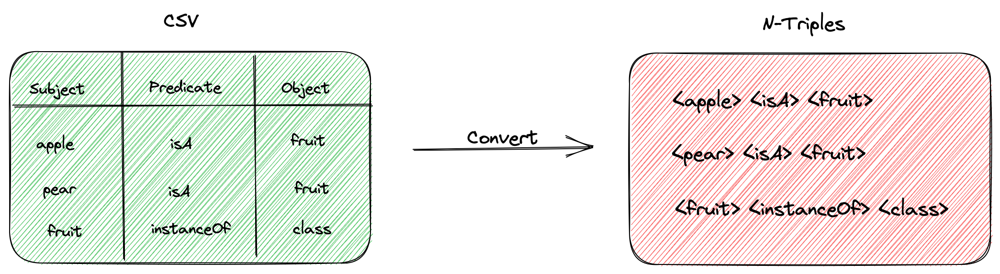

<h1 align="center">N-Triples Converter</h1>

<p align="center">A CSV to N-triples Converter</p>

## Overview

Convert your CSV files into N-Triples files ready to be imported into a RDF graph database.
<p align="center"></p>

## Versions & Releases

## Getting Started

```
go run cmd/main.go -filepath="cmd/reader/fixtures/test_data.csv" -namespace="hello"
```

## Running Tests

```
make test
```
